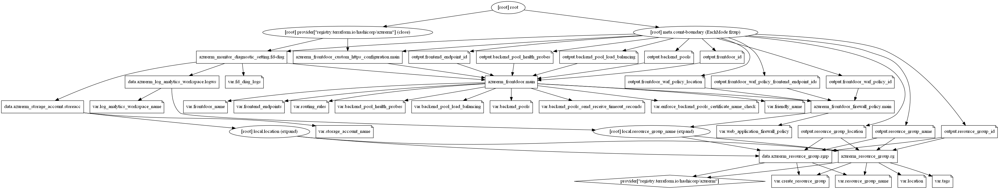

# Azure Front Door Terraform Module

Azure Front Door is a fast, reliable, and secure modern cloud CDN that uses the Microsoft global edge network and integrates with intelligent threat protection. It combines the capabilities of Azure Front Door, Azure Content Delivery Network (CDN) standard, and Azure Web Application Firewall (WAF) into a single secure cloud CDN platform.

This Terraform module helps create Microsoft's highly available and scalable web application acceleration platform and global HTTP(s) load balancer Azure Front Door Service with Web Application Firewall policies and SSL offloading.

## Module Usage

```terraform
# Azurerm Provider configuration
provider "azurerm" {
  features {}
}

module "frontdoor" {
  source  = "kumarvna/frontdoor/azurerm"
  version = "1.0.0"

  # By default, this module will not create a resource group. Location will be same as existing RG.
  # proivde a name to use an existing resource group, specify the existing resource group name, 
  # set the argument to `create_resource_group = true` to create new resrouce group.
  resource_group_name = "rg-shared-westeurope-01"
  location            = "westeurope"
  frontdoor_name      = "example-frontdoor51"

  routing_rules = [
    {
      name               = "exampleRoutingRule1"
      accepted_protocols = ["Http", "Https"]
      patterns_to_match  = ["/*"]
      frontend_endpoints = ["exampleFrontendEndpoint1"]
      forwarding_configuration = {
        forwarding_protocol = "MatchRequest"
        backend_pool_name   = "exampleBackendBing"
      }
    }
  ]

  backend_pool_load_balancing = [
    {
      name = "exampleLoadBalancingSettings1"
    }
  ]

  backend_pool_health_probes = [
    {
      name = "exampleHealthProbeSetting1"
    }
  ]

  backend_pools = [
    {
      name = "exampleBackendBing"
      backend = {
        host_header = "www.bing.com"
        address     = "www.bing.com"
        http_port   = 80
        https_port  = 443
      }
      load_balancing_name = "exampleLoadBalancingSettings1"
      health_probe_name   = "exampleHealthProbeSetting1"
    }
  ]

  # In order to enable the use of your own custom HTTPS certificate you must grant  
  # Azure Front Door Service access to your key vault. For instuctions on how to  
  # configure your Key Vault correctly. Please refer to the product documentation.
  # https://bit.ly/38FuAZv

  frontend_endpoints = [
    {
      name      = "exampleFrontendEndpoint1"
      host_name = "kumars-frontdoor21.azurefd.net"
    },
    {
      name      = "exampleFrontendEndpoint2"
      host_name = "kumars-frontdoor22.azurefd.net"
      custom_https_configuration = {
        certificate_source = "FrontDoor"
      }
    },
    {
      name      = "exampleFrontendEndpoint3"
      host_name = "kumars-frontdoor23.azurefd.net"
      custom_https_configuration = {
        certificate_source                         = "AzureKeyVault"
        azure_key_vault_certificate_vault_id       = ""       # valid keyvalut id
        azure_key_vault_certificate_secret_name    = ""       # valid certificate secret
        azure_key_vault_certificate_secret_version = "Latest" # optional, use "latest" if not defined
      }
    }
  ]

  # (Optional) To enable Azure Monitoring for Azure Frontdoor
  # (Optional) Specify `storage_account_name` to save monitoring logs to storage. 
  log_analytics_workspace_name = "loganalytics-we-sharedtest2"

  # Adding TAG's to your Azure resources 
  tags = {
    ProjectName  = "demo-internal"
    Env          = "dev"
    Owner        = "user@example.com"
    BusinessUnit = "CORP"
    ServiceClass = "Gold"
  }
}
```

## Module Usage examples for

* [Frontdoor with SSL Offloading](examples/frontdoor_with_custom_https_configuration/)
* [Frontdoor with WAF Policies](examples/frontdoor_with_waf_policies/)

## **`backend_pools`** - Backends and backend pools

A backend pool in Front Door refers to the set of backends that receive similar traffic for their app. In other words, it's a logical grouping of your app instances across the world that receive the same traffic and respond with expected behavior. These backends are deployed across different regions or within the same region. All backends can be in Active/Active deployment mode or what is defined as Active/Passive configuration.

Front Door backends refers to the host name or public IP of your application that serves your client requests. Front Door supports both Azure and non-Azure resources in the backend pool. The application can either be in your on-premises datacenter or located in another cloud provider.

`backend_pools` object accepts following argumnets

| Name | Description
|--|--
`name`| Specifies the name of the Backend Pool
`load_balancing_name`|Specifies the name of the `backend_pool_load_balancing` block within this resource to use for this `Backend Pool`.
`health_probe_name`|Specifies the name of the `backend_pool_health_probe` block within this resource to use for this `Backend Pool`.
||**`backend` - A backend block as defined below**||
`address`|Location of the backend (IP address or FQDN)
`host_header`|The value to use as the host header sent to the backend.
`http_port`|The HTTP TCP port number. Possible values are between `1` - `65535`.
`https_port`|The HTTPS TCP port number. Possible values are between `1` - `65535`.
`priority`| Priority to use for load balancing. Higher priorities will not be used for load balancing if any lower priority backend is healthy. Defaults to `1`.
`weight`| Weight of this endpoint for load balancing purposes. Defaults to `50`.

## **`backend_pool_health_probes`** - Health probes

To determine the health and proximity of each backend for a given Front Door environment, each Front Door environment periodically sends a synthetic HTTP/HTTPS request to each of your configured backends. Front Door then uses these responses from the probe to determine the "best" backend resources to route your client requests.

> For lower load and cost on your backends, Front Door recommends using `HEAD` requests for health probes.

`backend_pool_health_probes` object accepts following argumnets

| Name | Description
|--|--
`name`|Specifies the name of the Health Probe.
`enabled`|Is this health probe enabled? Dafaults to `true`.
`path`|The path to use for the Health Probe. Default is `/`.
`protocol`|Protocol scheme to use for the Health Probe. Defaults to `Http`.
`probe_method`|Specifies HTTP method the health probe uses when querying the backend pool instances. Possible values include: `Get` and `Head`. Defaults to `Get`.
`interval_in_seconds`| The number of seconds between each Health Probe. Defaults to `120`.


## Recommended naming and tagging conventions

Applying tags to your Azure resources, resource groups, and subscriptions to logically organize them into a taxonomy. Each tag consists of a name and a value pair. For example, you can apply the name `Environment` and the value `Production` to all the resources in production.
For recommendations on how to implement a tagging strategy, see Resource naming and tagging decision guide.

>**Important** :
Tag names are case-insensitive for operations. A tag with a tag name, regardless of the casing, is updated or retrieved. However, the resource provider might keep the casing you provide for the tag name. You'll see that casing in cost reports. **Tag values are case-sensitive.**

An effective naming convention assembles resource names by using important resource information as parts of a resource's name. For example, using these [recommended naming conventions](https://docs.microsoft.com/en-us/azure/cloud-adoption-framework/ready/azure-best-practices/naming-and-tagging#example-names), a public IP resource for a production SharePoint workload is named like this: `pip-sharepoint-prod-westus-001`.

## Requirements

| Name | Version |
|------|---------|
| terraform | >= 0.13 |
| azurerm | >= 2.59.0 |

## Providers

| Name | Version |
|------|---------|
| azurerm | >= 2.59.0 |

## Inputs

Name | Description | Type | Default
---- | ----------- | ---- | -------
`resource_group_name`|The name of an existing resource group.|string|`""`
`location`|The location for all resources while creating a new resource group.|string|`""`
`log_analytics_workspace_name`|The name of log analytics workspace name|string|`null`
`storage_account_name`|The name of the hub storage account to store logs|string|`null`
`Tags`|A map of tags to add to all resources|map|`{}`

## Outputs

Name | Description
---- | -----------
`resource_group_name`| The name of the resource group in which resources are created
`resource_group_id`| The id of the resource group in which resources are created
`resource_group_location`| The location of the resource group in which resources are created

## Resource Graph



## Authors

Originally created by [Kumaraswamy Vithanala](mailto:kumarvna@gmail.com)

## Other resources

* [Azure Frontdoor documentation](https://docs.microsoft.com/en-us/azure/frontdoor/front-door-overview)

* [Terraform AzureRM Provider Documentation](https://www.terraform.io/docs/providers/azurerm/index.html)
